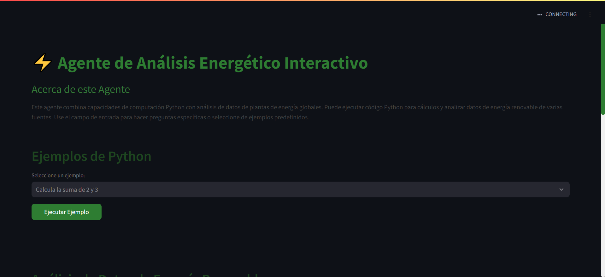

# Proyecto2-IA: Agente Interactivo de Análisis Energético

Una aplicación basada en Python que combina capacidades de IA con análisis integral de datos energéticos. Esta herramienta aprovecha LangChain, GPT-4 de OpenAI y Streamlit para proporcionar análisis y visualización interactiva de datos energéticos.

## Características

- **Análisis Python Interactivo**: Ejecuta código Python y realiza cálculos en tiempo real
- **Análisis de Datos Energéticos**: Procesa y analiza datos de múltiples conjuntos de datos relacionados con energía
- **Consultas Predefinidas**: Accede a conjuntos categorizados de preguntas comunes sobre análisis energético
- **Consultas Personalizadas**: Realiza tus propias preguntas sobre datos energéticos
- **Múltiples Fuentes de Datos**: Análisis de varios conjuntos de datos energéticos, incluyendo:
  - Datos de Energía Renovable
  - Información Global de Plantas de Energía
  - Datos de Generación de Plantas
  - Datos de Generación Térmica y Nuclear


## 📹 Demostración
(Haz click a la imagen)
[](https://youtu.be/AAXXX63LwSw)
Link del Video: https://youtu.be/AAXXX63LwSw

## Prerrequisitos

- Python 3.8 o superior
- Clave API de OpenAI

## Instalación

1. Clona el repositorio:
```bash
git clone https://github.com/Maria-Villafuerte/Proyecto2-IA.git
cd Proyecto2-IA
```

2. Instala las dependencias requeridas:
```bash
pip install -r requirements.txt
```

3. Crea un archivo `.env` en la raíz del proyecto y añade tu clave API de OpenAI:
```env
OPENAI_API_KEY=tu_clave_api_aquí
```

4. Asegúrate de que tus archivos CSV estén en el directorio correcto:
```
DocumentosCsv/
    ├── Renewable.csv
    ├── file_02.csv
    ├── Global Power Plant.csv
    └── Plant_2_Generation_Data.csv
```

### Ejecutando la Aplicación

Inicia la aplicación usando Streamlit:
```bash
streamlit run main.py
```

## ️ Detalles Técnicos

### Componentes Principales

- **Streamlit**: Interfaz web y visualización
- **LangChain**: Framework y herramientas de agentes IA
- **OpenAI GPT-4**: Modelo de lenguaje para análisis
- **Python REPL Tool**: Para ejecutar código Python
- **Agentes CSV**: Para análisis especializado de datos

### Estructura del Proyecto

```
├── main.py                 # Archivo principal de la aplicación
├── requirements.txt        # Dependencias del proyecto
├── .env                   # Variables de entorno
└── DocumentosCsv/         # Directorio de datos
    └── [Archivos CSV]     # Conjuntos de datos para análisis
```
